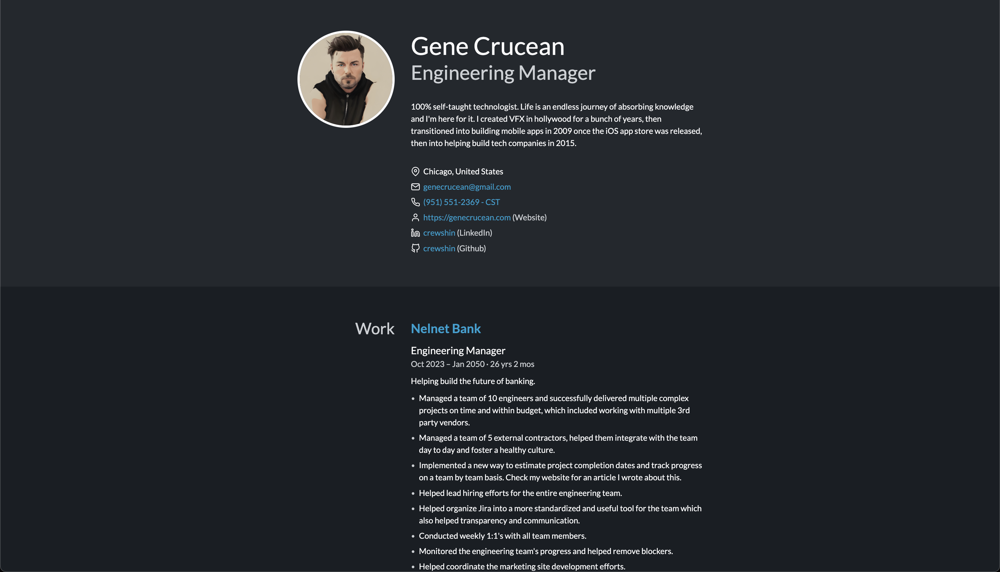

# jsonresume-theme-crewshin

- 💄 Markdown support
- 📐 CSS grid layout
- 🌗 Light and dark modes
- 🎨 Customizable colors
- 🧩 Standalone CLI
- 📦 ESM and CommonJS builds
- 🤖 TypeScript typings

[View live demo →](https://crewshin.github.io/resume/index.html)



## Installation

```console
npm install jsonresume-theme-crewshin
```

## Usage

### With resume-cli

[resume-cli](https://github.com/jsonresume/resume-cli) comes with _Even_ and uses it by default, so you don't even (pun intended) need to install the theme yourself:

```console
npm install resume-cli
npx resume export resume.html
```

### With Resumed

[Resumed](https://github.com/rbardini/resumed) requires you to install the theme, since it does not come with any by default. It will then automatically load and use _Even_ when rendering a resume:

```console
npm install resumed jsonresume-theme-even
npx resumed render --theme jsonresume-theme-even
```

### Standalone usage

_Even_ comes with a barebones CLI that reads resumes from `stdin` and outputs HTML to `stdout`. This allows usage without any resume builder tools:

```console
npx jsonresume-theme-even < resume.json > resume.html
```

## Options

### Colors

You can override theme colors via the `.meta.themeOptions.colors` resume field. Each entry defines a tuple of light and (optional) dark color values. If only one array value is defined, it will be used in both light and dark modes.

Here's an example using the default theme colors:

```json
{
  "meta": {
    "themeOptions": {
      "colors": {
        "background": ["#ffffff", "#191e23"],
        "dimmed": ["#f3f4f5", "#23282d"],
        "primary": ["#191e23", "#fbfbfc"],
        "secondary": ["#6c7781", "#ccd0d4"],
        "accent": ["#0073aa", "#00a0d2"]
      }
    }
  }
}
```
